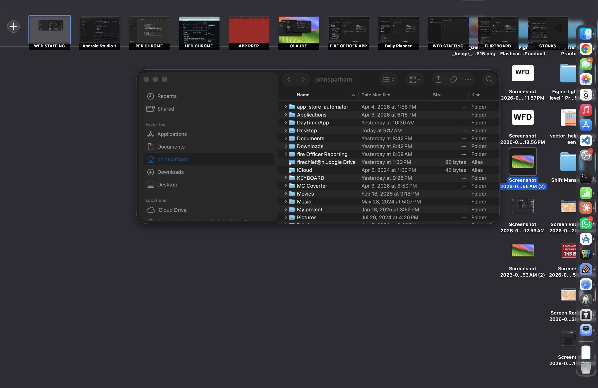

# Space Labeler

A lightweight macOS menu bar app that lets you label your Spaces (virtual desktops) with custom names.

If you use multiple Spaces and can't tell them apart, Space Labeler gives each one a name you can actually read.

 

## Features

- **Menu bar label** -- always shows the name of your current Space
- **HUD banner** -- a brief overlay appears when you switch Spaces (Ctrl+Arrow)
- **Mission Control labels** -- custom names appear below each Space thumbnail when you swipe up with 3 fingers
- **Rename from the menu bar** -- click the label, pick a Space, type a new name
- **Start at Login** -- toggle from the menu, uses macOS Login Items
- **Lightweight** -- 66KB DMG, no dependencies, pure Swift + AppKit

## Screenshot



## Download

Download the latest **[SpaceLabeler.dmg](https://github.com/JohnSparham/MacSpaceLabeler/releases/latest)** from the Releases page.

1. Open the DMG
2. Drag **SpaceLabeler** to Applications
3. Launch it -- a label appears in your menu bar
4. Grant **Accessibility** permission when prompted (needed for Mission Control labels)

## How It Works

- Detects Spaces using CoreGraphics private APIs (`CGSGetActiveSpace`, `CGSCopyManagedDisplaySpaces`)
- Listens for `NSWorkspace.activeSpaceDidChangeNotification` to detect Space switches
- Reads the Mission Control Accessibility tree to position overlay labels on Space thumbnails
- Labels are stored in `~/Library/Application Support/SpaceLabeler/config.json`

## Requirements

- macOS 13 (Ventura) or later
- Accessibility permission (for Mission Control overlay labels)

## Building from Source

```bash
git clone https://github.com/JohnSparham/MacSpaceLabeler.git
cd MacSpaceLabeler
xcodebuild -project SpaceLabeler.xcodeproj -scheme SpaceLabeler -configuration Release build
```

The built app will be in `~/Library/Developer/Xcode/DerivedData/SpaceLabeler-*/Build/Products/Release/SpaceLabeler.app`.

## License

MIT
